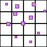
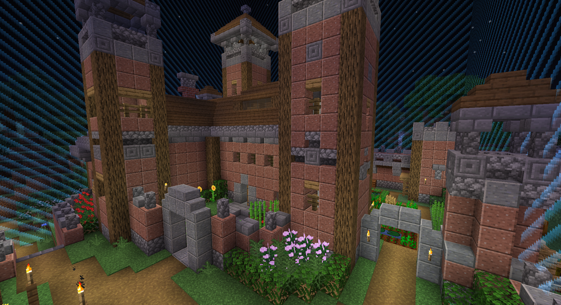
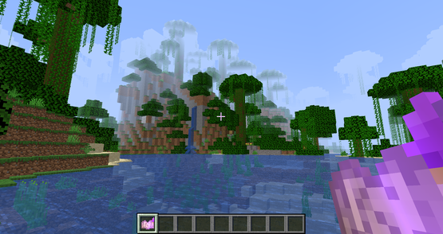
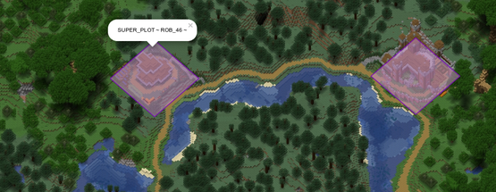

<!-- PROJECT SHIELDS -->

[![Version][version-shield]][version-url]
[![Download][download-shield]][download-url]
[![Tested Versions][tested-shield]][tested-url]
[![MIT License][license-shield]][license-url]

<!-- PROJECT LOGO -->
 

  

  ### Player Plot  *Build without fear!*
  **[Explore the docs »](https://github.com/Whitescan/PlayerPlot)**
   
  [Report Bug](https://github.com/Whitescan/PlayerPlot/-/issues)
  ·
  [Request Feature](https://github.com/Whitescan/PlayerPlot/-/issues)
  

<!-- TABLE OF CONTENTS -->
## Table of Contents

* [About the Project](#about-the-project)
  * [Built With](#built-with)
* [Getting Started](#getting-started)
  * [Prerequisites](#prerequisites)
  * [Installation](#installation)
* [Usage](#usage)
  * [Protection](#protection)
  * [Upgrading](#upgrading)
  * [Dynmap](#dynmap)
* [Contributing](#contributing)
* [License](#license)
* [Contact](#contact)
* [Acknowledgements](#acknowledgements)

<!-- ABOUT THE PROJECT -->
## About The Project

Player Plot is a self-serve protection plugin for Minecraft. It allows users to unlock and claim protected regions. 
The plugin is extremely scalable thanks to plots beings stored in grid zones. 
The plugin is also very user-friendly because any plot's border can be made visible using the /plot scan command.

#### Built With

* [Spigot](https://www.spigotmc.org/)

<!-- GETTING STARTED -->
## Getting Started

The latest version of Player Plot is available on [SpigotMC](https://www.spigotmc.org/resources/player-plot.68033/).

#### Prerequisites

![Tested Versions][tested-shield]

Player Plot requires a Minecraft server running one of the tested version displayed above.

#### Installation

Install PlayerPlot like any other Spigot plugin. If you need a refresher you can refer to [Installation](https://github.com/Whitescan/PlayerPlot/-/wikis/setup/installation).

<!-- USAGE EXAMPLES -->
## Usage

A plot is a protected zone that belongs to an owning player. Plots can be managed by using /plot commands while standing in the target plot. 
Plots can also be edited remotely by using the /plot @[plot] format.

#### Protection

Plots offer robust protection from both players and the elements. Plots protect from the following:

- Unauthorized building
- Unauthorized breaking
- Unauthorized use (for example chests/doors)
- Unauthorized harming of animals
- Explosions
- Fire-spread
- Outside pistons
- Outside dragon egg teleportion
- Outside water/lava flow
- Farmland Trampling
- And More!

#### Upgrading

When upgrading a plot, it is assigned a new side length so that the total plot size increases by the area of a single plot. 
For example, upgrading a plot once will result in a plot that is twice the size of the original. 
Upgrading a plot twice will result in a plot that is three times the size of the original. 
Upgrading an existing plot will consume a plot slot.

Downgrading a plot will reduce the size back by the area of a single plot. 
After fully downgrading a plot, it will be the same size and in the exact same position as the original plot. 
The plots that were consumed during the upgrade process will be returned to the player.

#### Plot Deeds

Players unlock new plots by obtaining and right clicking on a plot deed. 
The plugin comes with an optional resource pack that adds custom textures to plot deeds.

You can download the resource pack [here](https://github.com/Whitescan/PlayerPlot/-/wikis/misc/resource-pack).

#### Dynmap

Player Plot is compatible with dynmap. Configure the dynmap with the options in the config.yml file.

_For more information, please refer to the [Documentation](https://github.com/Whitescan/PlayerPlot/-/wikis/home)._

<!-- CONTRIBUTING -->
## Contributing

Contributions are what make the open source community such an amazing place to be learn, inspire, and create. Any contributions you make are greatly appreciated.

See [CONTRIBUTING](https://github.com/Whitescan/PlayerPlot/blob/main/CONTRIBUTING.md) for more information.

<!-- LICENSE -->
## License

Distributed under the MIT License. See [LICENSE](https://github.com/Whitescan/PlayerPlot/blob/main/LICENSE.txt) for more information.

<!-- CONTACT -->
## Contact

[Discord](https://discord.gg/Uszg4C55Ev)
Whitescan: whitescan.minecraft@gmail.com

<!-- ACKNOWLEDGEMENTS -->
## Acknowledgements

* [Original](https://gitlab.com/sword7/playerplot)
* [XSeries](https://github.com/CryptoMorin/XSeries)

<!-- MARKDOWN LINKS & IMAGES -->
<!-- https://www.markdownguide.org/basic-syntax/#reference-style-links -->
[version-shield]: https://img.shields.io/spiget/version/68033?label=&labelColor=EE22EE&color=FF55FF
[version-url]: https://www.spigotmc.org/resources/player-plot.68033/
[download-shield]: https://img.shields.io/spiget/downloads/68033?&color=efb61c&style=flat-square&logo=image%2Fx-icon%3Bbase64%2CAAABAAEAEBAQAAAAAAAoAQAAFgAAACgAAAAQAAAAIAAAAAEABAAAAAAAgAAAAAAAAAAAAAAAEAAAAAAAAAAAAAAAAND%2FAOhGOgA%2F6OIAAAAAAAAAAAAAAAAAAAAAAAAAAAAAAAAAAAAAAAAAAAAAAAAAAAAAAAAAAAAAAAAAAAAAAAAAAiAAAAAAAAACIAAAAAAAAAIgAAAAAAAAAAAAAAAAAAABEAAAAzMQABEQAAARMzEBERARERETMxERAAAAARMzEAAAAAAAETMwAAAAAAABEwAAAAAAAAERAAAAAAAAABAAAAAAAAAAEAAAAAAAAAAAAAAAAAAAAAAAAAD%2F%2BQAA%2F%2FkAAP%2F5AAD%2F8AAA%2BDAAAPAgAAAAAAAAAAEAAAADAADwDwAA%2FB8AAPwfAAD8HwAA%2Fj8AAP4%2FAADwBwAA
[download-url]: https://www.spigotmc.org/resources/player-plot.68033/
[license-shield]: https://img.shields.io/badge/license-MIT-blue?style=flat-square
[tested-shield]: https://img.shields.io/spiget/tested-versions/68033?style=flat-square
[tested-url]: https://www.spigotmc.org/resources/player-plot.68033/
[license-url]: https://github.com/Whitescan/PlayerPlot/-/blob/master/LICENSE
[product-screenshot]: images/screenshot.png
